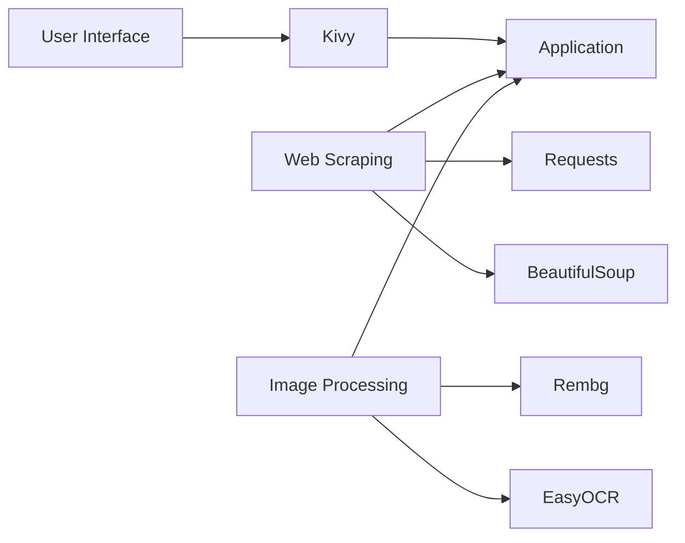

# MediSearch 🔍💊


A smart medicine search application that combines text and image recognition to provide drug information from [galinos.gr](https://www.galinos.gr).

## Features ✨

- **Multiple Search Methods**:
  - Text search by medicine name
  - Camera capture with text recognition
  - Photo upload from device
- **Information Retrieval**:
  - Detailed medicine descriptions
  - Usage instructions
  - Side effects
- **Image Processing**:
  - Background removal
  - Text extraction (OCR)
- **User-Friendly Interface**:
  - Simple navigation between screens
  - Local photo storage
  - Responsive design

## Installation 📦

### Prerequisites
```bash
pip install kivy requests beautifulsoup4 rembg easyocr matplotlib pillow AppOpener IPython
```
Run the Application

```bash
python medicine_search.py
```
## Technology Stack 🛠️

### Core Components


