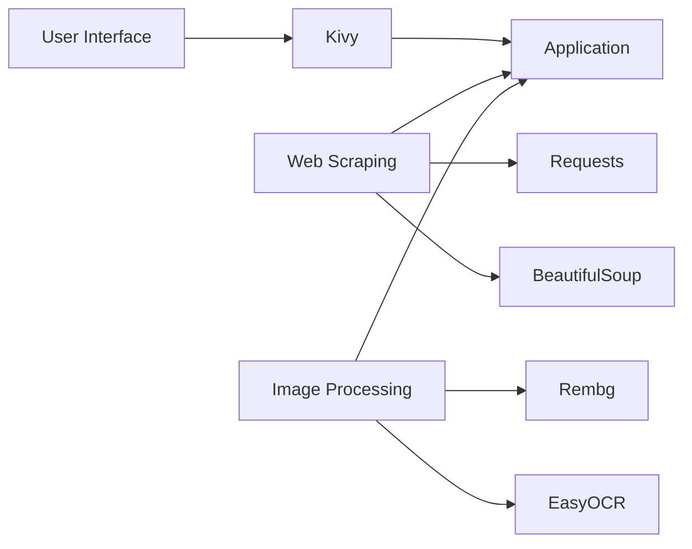
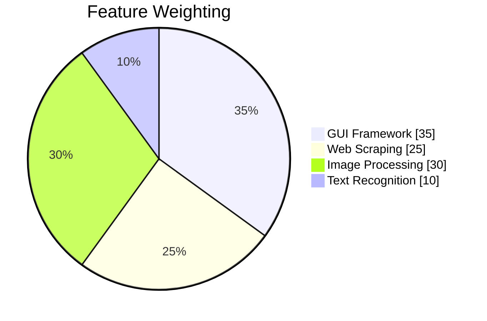

# MediSearch 🔍💊


A smart medicine search application that combines text and image recognition to provide drug information from [galinos.gr](https://www.galinos.gr).

## Features ✨

- **Multiple Search Methods**:
  - Text search by medicine name
  - Camera capture with text recognition
  - Photo upload from device
- **Information Retrieval**:
  - Detailed medicine descriptions
  - Usage instructions
  - Side effects
- **Image Processing**:
  - Background removal
  - Text extraction (OCR)
- **User-Friendly Interface**:
  - Simple navigation between screens
  - Local photo storage
  - Responsive design

## Installation 📦

### Prerequisites
```bash
pip install kivy requests beautifulsoup4 rembg easyocr matplotlib pillow AppOpener IPython
```
Run the Application

```bash
python medicine_search.py
```
## Technology Stack 🛠️

### Core Components


| Icon       | Library                                                                       | Purpose	                          | Version        |  Docs   |
|------------|-------------------------------------------------------------------------------|------------------------------------|----------------|---------|
|                        |	Kivy	Cross-platform GUI framework|	≥ 2.0	         |📚 Docs  |
|	Requests	HTTP requests handling	| 2.28+	         |📚 Docs  |
 |	BeautifulSoup	HTML/XML parsing	  | 4.11+	         |📚 Docs  |
	         |  Rembg	Background removal	        | 2.0+	         |📚 Docs  |
	     |  EasyOCR	Text recognition	        | 1.6+	         |📚 Docs  |

## 📊 Technology Distribution



**Legend**:
- GUI: Kivy implementation
- Web: Requests + BeautifulSoup
- Imaging: Rembg pipeline
- OCR: EasyOCR integration
